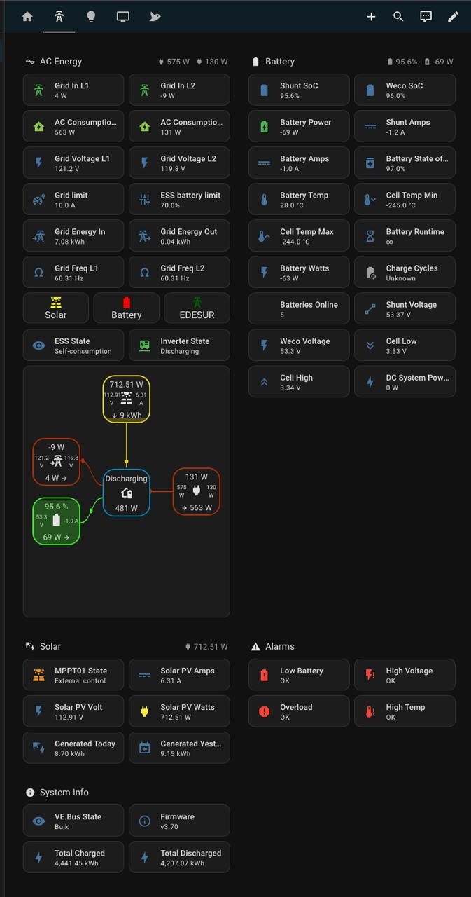

# Victron MQTT Sensors for Home Assistant



MQTT sensor configuration for **Victron Cerbo GX** devices with full **split-phase (L1/L2)** support, plus a ready-to-use Home Assistant ESS dashboard with an energy flow diagram.

## What's Included

### `victron_mqtt.yaml` — MQTT Sensor Definitions

All sensors use the `{"value": ...}` JSON payload format published by Venus OS over MQTT.

| Category | Sensors |
|---|---|
| **Solar (MPPT)** | MPPT State, PV Voltage, PV Current, PV Power, Day Generation, Yesterday Generation |
| **Battery (Shunt/288)** | State of Charge, Current, Voltage |
| **Battery (Weco/512)** | State of Charge, Current, Voltage, Temperature, State of Health, Cycles, Min/Max Cell Temp, Min/Max Cell Voltage, Batteries Online |
| **Battery System** | Battery Power, Battery Load, Battery State, Battery Remaining (time-to-go), DC System Power, Charged/Discharged History |
| **Grid / Inverter** | Grid Load L1/L2, Grid Voltage L1/L2, AC Consumption L1/L2, Grid Frequency L1/L2, Grid Current Limit, Inverter Output L1/L2, Grid Energy From/To |
| **States** | Grid Status, Inverter State, ESS State, VE.Bus State |
| **Alarms** | Low Battery, High DC Voltage, Overload, High Temperature |
| **System Info** | Firmware Version |

### `home-assistant-dashboard.yaml` — ESS Dashboard

A standalone ESS dashboard (sections layout) with:

- **Energy flow diagram** (`custom:system-flow-card`) showing grid, solar, battery, and consumption with L1/L2 detail
- **AC Energy section** — grid power, voltage, frequency, consumption, energy counters per phase, and status indicators for Solar/Battery/Grid
- **Battery section** — SoC (shunt + Weco), voltage, current, temperature, cell stats, cycles, runtime, and DC system power
- **Solar section** — MPPT state, PV power/voltage/current, today and yesterday generation
- **Alarms section** — conditional cards that only appear when an alarm is active (Low Battery, High Voltage, Overload, High Temperature)
- **System Info section** — VE.Bus state, firmware version, total charged/discharged energy
- **Live Trends section** — collapsible charts (via `custom:expander-card`) with solar vs battery, grid L1/L2, battery SoC, and a daily overview graph

## Requirements

- **Victron Cerbo GX** (or other Venus OS device) with MQTT enabled
- **MQTT broker** (e.g., Mosquitto) connected to both the Cerbo and Home Assistant
- **Home Assistant** with the [MQTT integration](https://www.home-assistant.io/integrations/mqtt/) configured
- **HACS custom cards** (for the dashboard):
  - [custom:button-card](https://github.com/custom-cards/button-card)
  - [custom:system-flow-card](https://github.com/nicufarmache/system-flow-card)
  - [custom:mini-graph-card](https://github.com/kalkih/mini-graph-card)
  - [custom:apexcharts-card](https://github.com/RomRider/apexcharts-card)
  - [custom:expander-card](https://github.com/Alia5/lovelace-expander-card)

## Installation

### 1. Update the Portal ID

Replace `c0619ab4fedf` in `victron_mqtt.yaml` with your own Cerbo GX portal ID. You can find it in:

- **Cerbo GX** → Settings → VRM online portal → VRM Portal ID
- Or from your MQTT broker by subscribing to `victron/#` and checking the topic path

To replace all occurrences at once:

```bash
sed -i 's/c0619ab4fedf/YOUR_PORTAL_ID/g' victron_mqtt.yaml
```

### 2. Update Device IDs (if needed)

The default device IDs in this config are:

| Device | ID |
|---|---|
| Solar Charger (MPPT) | `0` |
| VE.Bus (Inverter) | `276` |
| Battery Monitor (Shunt) | `288` |
| Battery (Weco BMS) | `512` |

If your device IDs differ, update them in `victron_mqtt.yaml`. You can find yours by subscribing to `victron/N/YOUR_PORTAL_ID/#` on your MQTT broker.

### 3. Add to Home Assistant as a Package

Copy `victron_mqtt.yaml` to your Home Assistant config directory (e.g., `/config/victron_mqtt.yaml`), then add to your `configuration.yaml`:

```yaml
homeassistant:
  packages:
    victron: !include victron_mqtt.yaml
```

### 4. Restart Home Assistant

A full restart is required (not just a YAML reload) for packages to take effect.

### 5. Import the ESS Dashboard

In Home Assistant:

1. Go to **Settings → Dashboards → Add Dashboard**
2. Choose **"New dashboard from scratch"**
3. Open the new dashboard, click the three dots menu → **Edit dashboard**
4. Click the three dots again → **Raw configuration editor**
5. Paste the contents of `home-assistant-dashboard.yaml`
6. Save

The dashboard is a self-contained ESS view — no personal entities or unrelated views included.

## Enabling MQTT on Venus OS

If MQTT is not yet enabled on your Cerbo GX:

1. Go to **Settings → Services → MQTT** on the Cerbo GX
2. Enable **MQTT on LAN**
3. Set the broker to your MQTT server IP, or use the built-in broker
4. Set **Publish plain text** to **Enabled**

## License

MIT
